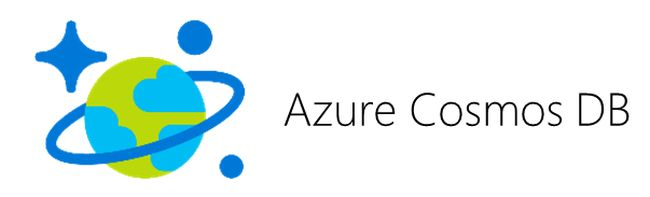
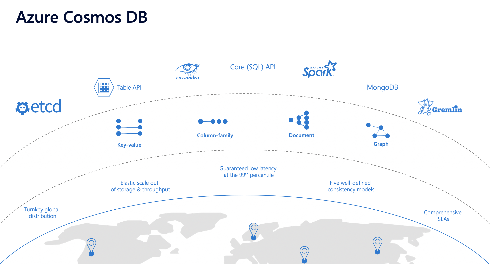
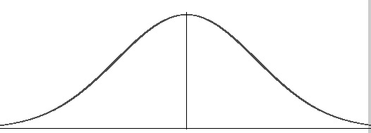
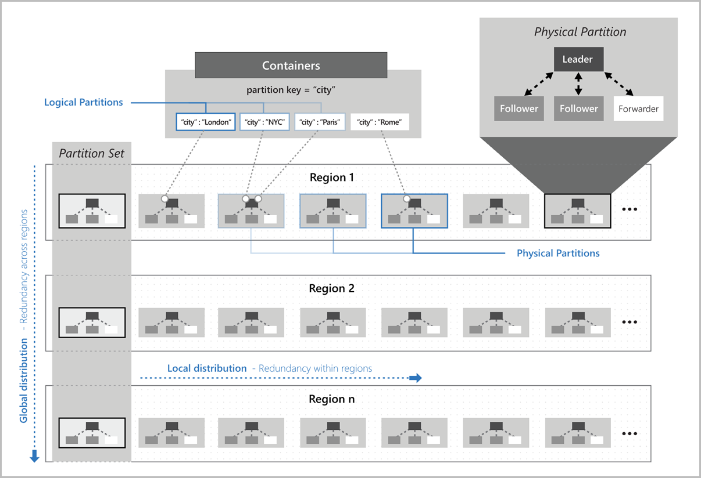
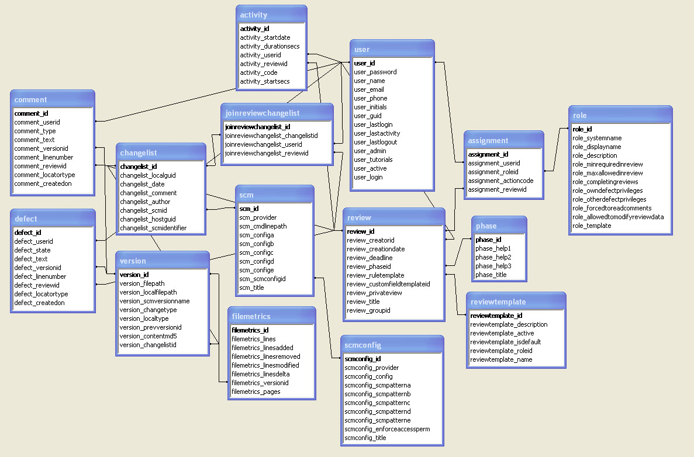
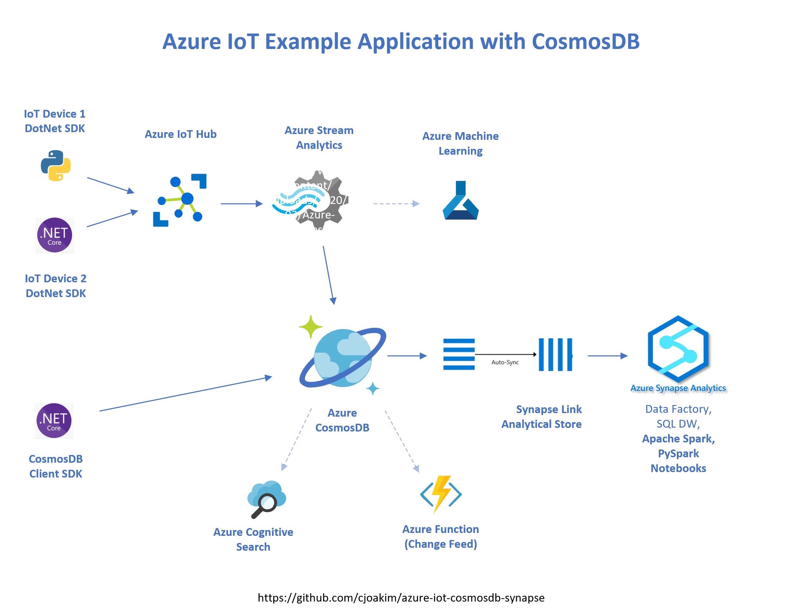

<p align="center" width="95%">
  
</p>

<p align="center" width="95%">
  
</p>

<p align="center" width="95%">
  
</p>

# Agenda

- Introduce CosmosDB and NoSQL
- Show CosmosDB in Azure Portal
- Demonstrate a working IoT app with CosmosDB
- Discuss related Azure PaaS services and CosmosDB integrations
- Cover DotNet Core C# code to access CosmosDB
- GitHub public repo takeaway for you to see the code and recreate the solution

## Chris Joakim, Senior Cloud Solution Architect @ Microsoft, chjoakim@microsoft.com

<p align="center" width="95%">
  
</p>

---

<p align="center" width="95%">
  
</p>

<p align="center" width="95%">
  
</p>

### What is CosmosDB?

  - **A family of high-performance, distributed, scalable NoSQL Databases built on a common foundation**
  - Wait, What exactly is NoSQL?
  - History of Databases, and What does NoSQL Solve?
    - Personal Story from 2009: Ruby on Rails web app with MySQL, adopting MongoDB
  - Other Databases in Azure - Azure SQL, Synapse DW, Azure PostgreSQL, Azure MySQL
  - [CosmosDB Documentation](https://azure.microsoft.com/en-us/services/cosmos-db/)
  - What does CosmosDB Solve?

### Main Benefits:

  - **PaaS service**, very easy to deploy and use
    - Microsoft manages the distributed infrastructure
  - **Guaranteed low latency**
    - 10ms reads and writes for 1K documents
  - **Turnkey Global Distribution/Replication**
    - Single Region, Multi-Region, or Multi-Master Regions
    - Fast automated replication across regions
    - Five consistency models - strong to eventual
  - **Elastic scale out of storage and throughput**
    - appropriate for small, medium, large, and huge workloads
    - **Request Units, RU**
    - Autoscale is available
  - **High Availability**
    - Single Region: 99.99%
    - Multi-Region: 99.999%
  - **Speed of Development**
    - Schemaless JSON
  - **Seamless Integration with many other Azure Services**


## Use Cases:
  - Lift and Shift - MongoDB, Cassandra
  - Greenfield - **SQL API**, Gremlin
  - [Other Use Cases](https://docs.microsoft.com/en-us/azure/cosmos-db/use-cases)

<p align="center" width="95%">
  
</p>

---

## High Availability and Performance SLA 

<p align="center" width="95%">
  
</p>

<p align="center" width="95%">
  
</p>

<p align="center" width="95%">
  
</p>

- **Performance SLA**, P99 Latency: "10ms for data item read or 10ms for data item write operations"
  - 1 KB documents, point reads
- [High Availability & P99 Latency](https://docs.microsoft.com/en-us/azure/cosmos-db/high-availability)

<p align="center" width="95%">
  
</p>

---

## Partitioning

### Concepts

- Logical Partition - Partition Key, /pk attribute
- Physical Partition - 50GB, Physical Partition Splits, Hot Partitions
- [Partitioning and horizontal scaling](https://docs.microsoft.com/en-us/azure/cosmos-db/partitioning-overview)

<p align="center" width="95%">
  
</p>

<p align="center" width="95%">
  
</p>

---

## Design

<p align="center" width="95%">
  
</p>

- Please **don't** design your CosmosDB database like this (see above relational diagram)!
  - It's **not** a Relational Database; Cosmos/SQL only refers to the SQL syntax used to query it
  - There are **no joins or referential integrity** between containers
- Start your design with **one** or **very few** containers, add others if necessary
- It's schemaless - documents in a container don't have to conform to a fixed schema
- Documents are simply JSON
- Only a **partition key** attribute is needed; I recommend **/pk**
- The **partition key** attribute **name** can't change once a container is created
- Strive for **high cardinality** and **well distributed** partition key values
- Strive to have most queries specify the partition key
- Embedding vs Externalizing Data within Documents
- **Let us help you with you first few designs/apps**

<p align="center" width="95%">
  
</p>

### Retail Example - Order, Line Item, Deliveries - in one Container

```
{
  "pk": "XK1123",
  "doctype": "order",
  "orderNumber": "XK1123",
  ... order attributes ...
}

{
  "pk": "XK1123",
  "doctype": "lineitem",
  "orderNumber": "XK1123",
  "lineItem": 1,
  ... lineitem attributes ...
}

{
  "pk": "XK1123",
  "doctype": "lineitem",
  "orderNumber": "XK1123",
  "lineItem": 2,
  ... lineitem attributes ...
}

{
  "pk": "XK1123",
  "doctype": "delivery",
  "orderNumber": "XK1123",
  "lineItem": 1,
  "deliveryNumber": 1,
  ... delivery attributes ...
}
```

### SQL Query for all or parts of the Order

```
select * from c where c.pk = "XK1123"
select * from c where c.pk = "XK1123" and c.doctype = "order"
select * from c where c.pk = "XK1123" and c.doctype in ("order", "lineitem")
```

<p align="center" width="95%">
  
</p>

---

## CosmosDB - other interesting features

- **Synapse Link** (described shortly)
- **Change-Feed** & Azure Functions
- **GeoSpatial queries**
- **Autoscale**
- Our CosmosDB **SDKs** include DotNet, Java, Node.js, Python
- **Server-Side Programming**
  - Stored Procedures - transactional within a partition key
  - UDFs - extend the SQL language
  - Triggers - they don't work as you might expect
- TTL
- Five Consistency Levels for Multi-Region; from Strong to Eventual

<p align="center" width="95%">
  
</p>

---

<p align="center" width="95%">
  
</p>

<p align="center" width="95%">
  
</p>

---

## Azure Synapse Link

[Azure Synapse Link](https://docs.microsoft.com/en-us/azure/cosmos-db/synapse-link) 

<p align="center" width="95%">
  
</p>

<p align="center" width="95%">
  
</p>

---

## Azure CosmosDB Events Collection

### The documents look like this in the dev database, events container

```
{
    "seq": 1,
    "epoch": 1603814840.398,
    "device_type": "dotnet",
    "device_os": "Darwin 19.6.0 Darwin Kernel Version 19.6.0: Mon Aug 31 22:12:52 PDT 2020; root:xnu-6153.141.2~1/RELEASE_X86_64",
    "device_version": ".NET Core 3.1.9",
    "device_pid": 8315,
    "line_speed": 9821,
    "temperature": 95,
    "humidity": 66,
    "EventProcessedUtcTime": "2020-10-27T16:07:20.4528575Z",
    "PartitionId": 1,
    "EventEnqueuedUtcTime": "2020-10-27T16:07:20.4160000Z",
    "IoTHub": {
        "MessageId": "a8718708-84f3-4737-bf5e-3d000af6c2de",
        "CorrelationId": "a8718708-84f3-4737-bf5e-3d000af6c2de",
        "ConnectionDeviceId": "cjiothubdevice2",
        "ConnectionDeviceGenerationId": "637391385793339080",
        "EnqueuedTime": "2020-10-27T16:07:20.4240000Z",
        "StreamId": null
    },
    "pk": "cjiothubdevice2|a8718708-84f3-4737-bf5e-3d000af6c2de",
    "id": "0d9e941a-c52b-6583-db01-6ec3feaace70",
    "_rid": "-+0aAIZz-A4PAAAAAAAAAA==",
    "_self": "dbs/-+0aAA==/colls/-+0aAIZz-A4=/docs/-+0aAIZz-A4PAAAAAAAAAA==/",
    "_etag": "\"1000ae2f-0000-0100-0000-5f9845b90000\"",
    "_attachments": "attachments/",
    "_ts": 1603814841
}
```

<p align="center" width="95%">
  
</p>

---

## Azure Synapse - PySpark Notebook

### Read the Analytical Store from CosmosDB

Notice how the schema in the Analytical Store was derived from the "shape"
of the documents in CosmosDB.

```
df = spark.read\
    .format("cosmos.olap")\
    .option("spark.synapse.linkedService", "cosmosdb_dev_db")\
    .option("spark.cosmos.container", "events")\
    .load()

display(df.printSchema())

root
 |-- _rid: string (nullable = true)
 |-- _ts: long (nullable = true)
 |-- seq: long (nullable = true)
 |-- epoch: double (nullable = true)
 |-- device_type: string (nullable = true)
 |-- device_os: string (nullable = true)
 |-- device_version: string (nullable = true)
 |-- device_pid: long (nullable = true)
 |-- line_speed: long (nullable = true)
 |-- temperature: long (nullable = true)
 |-- humidity: long (nullable = true)
 |-- EventProcessedUtcTime: string (nullable = true)
 |-- PartitionId: long (nullable = true)
 |-- EventEnqueuedUtcTime: string (nullable = true)
 |-- IoTHub: struct (nullable = true)
 |    |-- MessageId: string (nullable = true)
 |    |-- CorrelationId: string (nullable = true)
 |    |-- ConnectionDeviceId: string (nullable = true)
 |    |-- ConnectionDeviceGenerationId: string (nullable = true)
 |    |-- EnqueuedTime: string (nullable = true)
 |    |-- StreamId: integer (nullable = true)
 |-- pk: string (nullable = true)
 |-- id: string (nullable = true)
 |-- _etag: string (nullable = true)
```

<p align="center" width="95%">
  
</p>

---

## DotNet Core and DotNet 5

- https://dotnet.microsoft.com/download
- https://devblogs.microsoft.com/dotnet/introducing-net-5/
- https://docs.microsoft.com/en-us/dotnet/core/dotnet-five


### CosmosDB SDK

- dotnet add package **Microsoft.Azure.Cosmos**
- https://www.nuget.org/packages/Microsoft.Azure.Cosmos/3.14.0 
- https://github.com/Azure/azure-cosmos-dotnet-v3
- https://docs.microsoft.com/en-us/azure/cosmos-db/sql-api-sdk-dotnet
- https://docs.microsoft.com/en-us/dotnet/api/overview/azure/cosmosdb?view=azure-dotnet&preserve-view=true
- [microsoft.azure.cosmos SDK](https://docs.microsoft.com/en-us/dotnet/api/microsoft.azure.cosmos?view=azure-dotnet)


#### Code Samples

- See the **dotnet_cosmos** (Cosmos SDK) directory in this repo.
- See the **dotnet_device2** (IoT SDK) directory in this repo.

<p align="center" width="95%">
  
</p>

--- 

## CosmosDB Graph Databases

<p align="center" width="95%">
  
</p>

- [Bill of Material Azure-Samples](https://github.com/Azure-Samples/azure-cosmos-db-graph-npm-bom-sample)
- [6-Degrees of Kevin Bacon](https://github.com/cjoakim/azure-cosmos-graph)

---

## Azure Stream Analytics

Define the **iothub** input and the **cosmos-events** outputs, and the **job sql**
is as simple as the following.

This syntax is concatinating the IoT DeviceId with the MessageId to construct a
**partition key** for inserting into Azure CosmosDB.

```
SELECT
    *, 
    CONCAT (
        GetMetadataPropertyValue(iothub, '[IoTHub].[ConnectionDeviceId]'),
        '|',
        GetMetadataPropertyValue(iothub, '[IoTHub].[MessageId]') ) as pk 
INTO
    [cosmos-events]
FROM
    [iothub]
```

---

### IoT

- https://docs.microsoft.com/en-us/azure/iot-hub/quickstart-send-telemetry-dotnet
- https://docs.microsoft.com/en-us/samples/azure-samples/azure-iot-samples-csharp/azure-iot-samples-for-csharp-net/

---

## Azure IoT Edge

- https://azure.microsoft.com/en-us/services/iot-edge

---

## Python 

- https://pypi.org/project/azure-cosmos/
- https://pypi.org/project/azure-iot-hub/
- https://pypi.org/project/azure-mgmt-iothub/
- https://github.com/Azure/azure-iot-sdk-python/tree/master/azure-iot-device/samples

#### Python Code Samples

See the **py_device1** directory in this repo (IoT SDK)
